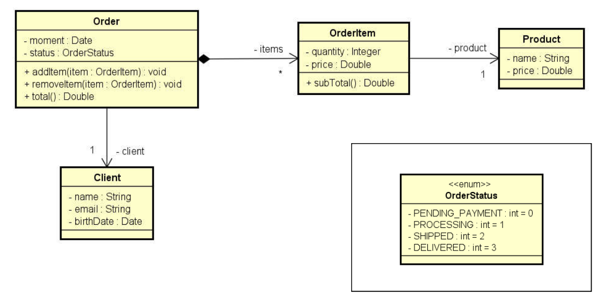
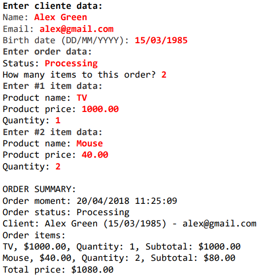

# orders_CSharp
Exercicio de fixação resolvido

## Proposta
Ler os dados de um pedido com N itens (N fornecido pelo usuário). Depois, mostrar um
sumário do pedido conforme exemplo (próxima página). Nota: o instante do pedido deve ser
o instante do sistema: DateTime.Now

## Resultado esperado

